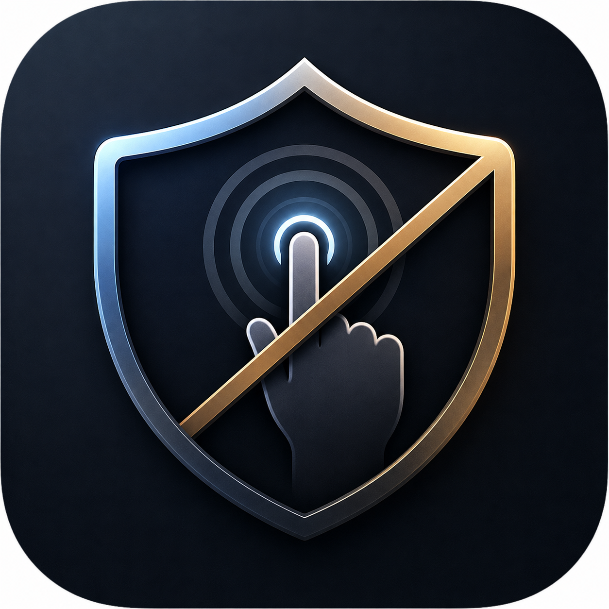

# ShieldTap

  

  <strong>Prevents unintended screen touches during phone calls.</strong> 
  통화 중 화면 오터치를 방지합니다.

---

<strong>🇰🇷 한국어</strong>

## ShieldTap이란?

삼성 보급형 스마트폰(A시리즈, FE시리즈, 퀀텀시리즈 등)은 하드웨어 근접센서 대신 카메라 기반 가상 근접센서를 사용합니다. 이 가상 센서는 느리고 부정확하여 통화 중 영상통화 전환, 음소거, 스피커폰, 통화 종료 등 화면 오터치가 발생합니다.

ShieldTap은 통화 중 터치 차단 오버레이를 씌워 이런 오터치를 방지합니다.

## 기능

| | 기본 (Basic) | 플러스 (Plus) |
|---|---|---|
| 사이드 탭 수동 켜기/끄기 | O | O |
| 통화 시 자동 활성화 | — | O |
| 가격 | 무료 | 무료 (Play Store) |

## 다운로드

- **Google Play Store** (권장): *준비 중*
- **GitHub Releases**: [APK 다운로드](https://github.com/blackcore76/ShieldTap/releases)

> **참고**: GitHub 릴리즈는 기본(Basic) 기능만 포함됩니다.
> 플러스(Plus) 기능(통화 시 자동 활성화)은 Google Play Store에서 설치해 주세요.

## 권한

| 권한 | 용도 |
|---|---|
| 접근성 서비스 | 화면 위에 터치 차단 오버레이를 표시합니다. 화면 내용을 읽거나 수집하지 않습니다. |
| 통화 감지 (플러스 전용) | 통화 시작/종료를 감지하여 자동 활성화합니다. 전화번호나 통화 내용에 접근하지 않습니다. |
| 배터리 최적화 예외 | 삼성 등 제조사의 백그라운드 서비스 강제 종료를 방지합니다. |

## 개인정보

ShieldTap은 어떠한 개인정보도 수집, 저장, 전송하지 않습니다. 인터넷 권한을 사용하지 않습니다.

[개인정보처리방침](https://blackcore76.github.io/ShieldTap/privacy-policy.html)

<strong>🇺🇸 English</strong>

## What is ShieldTap?

Budget Samsung Galaxy phones (Galaxy A series, FE series, Quantum series, etc.) use camera-based virtual proximity sensors instead of hardware IR sensors. These virtual sensors are slow and unreliable — causing accidental screen touches during calls that can trigger video calls, mute, speakerphone, or even hang up.

ShieldTap places a transparent touch-blocking overlay on your screen during calls to prevent these accidental touches.

## Features

| | Basic | Plus |
|---|---|---|
| Side tab manual on/off | O | O |
| Auto-activate during calls | — | O |
| Price | Free | Free (Play Store) |

## Download

- **Google Play Store** (recommended): *Coming soon*
- **GitHub Releases**: [Download APK](https://github.com/blackcore76/ShieldTap/releases)

> **Note**: GitHub releases include Basic features only.
> For Plus features (auto-activate during calls), please install from the Google Play Store.

## Permissions

| Permission | Purpose |
|---|---|
| Accessibility Service | Displays a touch-blocking overlay on screen. Does NOT read or collect any screen content. |
| Phone State (Plus only) | Detects call start/end for auto-activation. Does NOT access phone numbers or call content. |
| Battery Optimization Exemption | Prevents manufacturer (Samsung, etc.) from force-stopping the background service. |

## Privacy

ShieldTap does not collect, store, or transmit any personal information. No internet permission is used.

[Privacy Policy](https://blackcore76.github.io/ShieldTap/privacy-policy.html)

---

## License

MIT License

## Developer

BlackCore — blackcore@gmail.com
